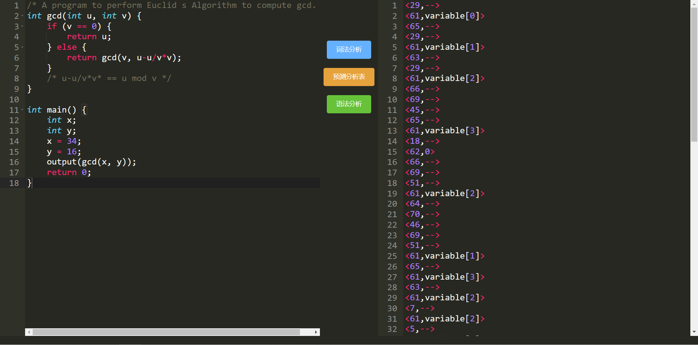
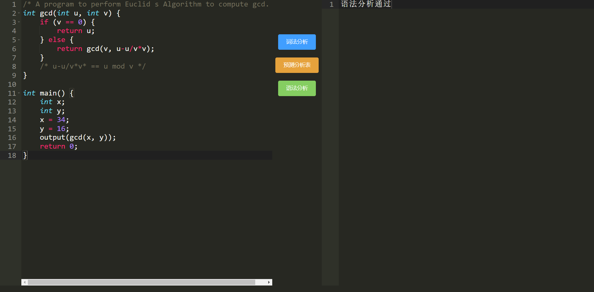
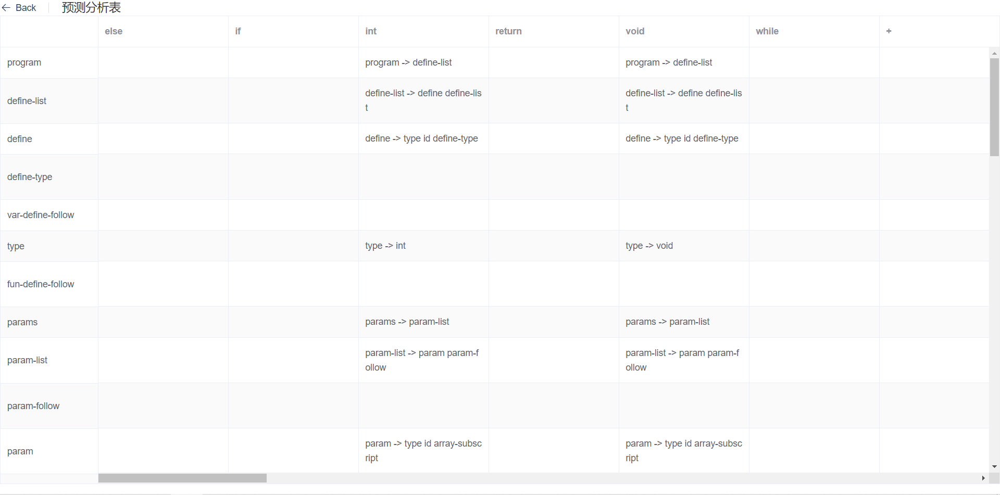

编译原理试验：词法分析+语法分析(LL(1))

项目：

- C编译器+RESTful API
- 代码编辑器+结果展示

### 后端

#### 后端项目目录解析：

```
│   app.py                    # 后端服务器启动文件
│   error.py                  # 编译器前端报错类
│   requirements.txt          # 环境配置
│   test.py                   # 编译器前端测试主函数
│
├───lex                       # 词法分析部分
│   │   constants.py          # 词法分析使用常量
│   │   lexical.py            # 词法分析主体部分
│   │   Token.py              # Token类
│   │   __init__.py
│
├───syntax                    # 语法分析部分
│   │   rule.py               # 文法规则
│   │   syntax.py             # 语法分析主体
│   │   __init__.py
│
└───test                      # 测试代码
        code.c					
        code2.c
```

#### 运行环境

- python 3.X

- Flask(1.1.2)

### 前端

#### 前端项目目录解析：

```
/src目录
│   App.vue
│   main.js
│
├───assets
├───components
│       Editor.vue         # 编辑器组件
│       Menu.vue           # 菜单组件
│       Output.vue         # 结果展示组件
│
├───request
│       request.js         # 二次封装的axios通讯
│
├───router
│       index.js           # 路由
│
├───store
│       index.js           # vuex管理的全局变量
│
└───views
        Home.vue           # Home视图
        Table.vue          # 预测表视图
```

#### 运行主要依赖

- Vue 3.X

#### 环境配置

1. 安装运行所需所有依赖

```shell
npm i
```

2. 测试环境运行

```shell
npm run serve
```

### 运行截图







